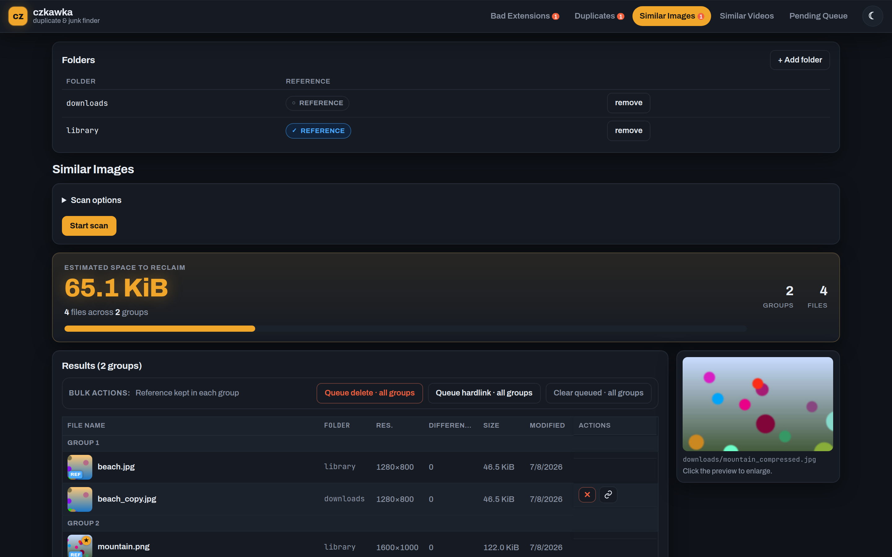
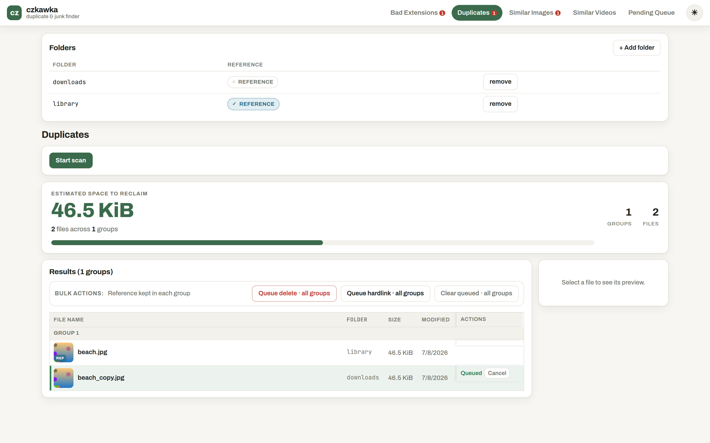
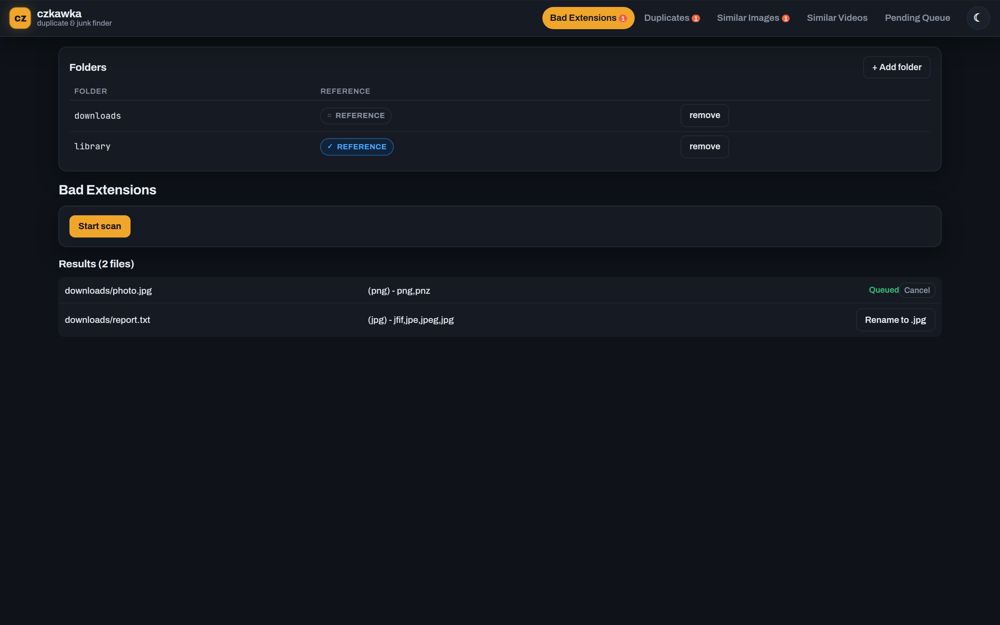
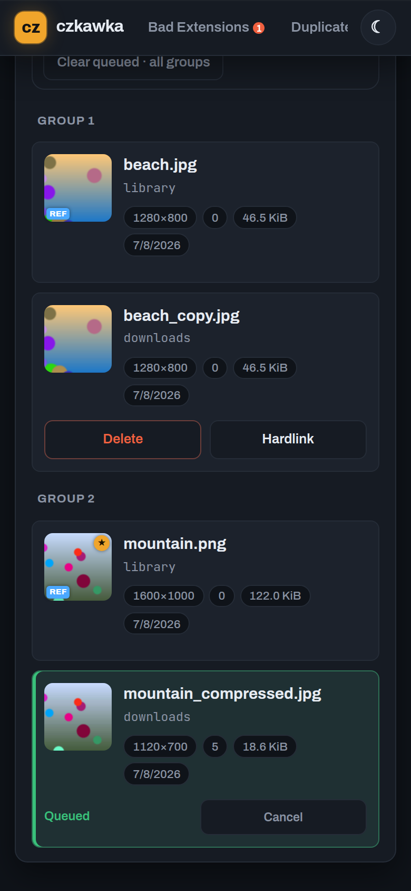
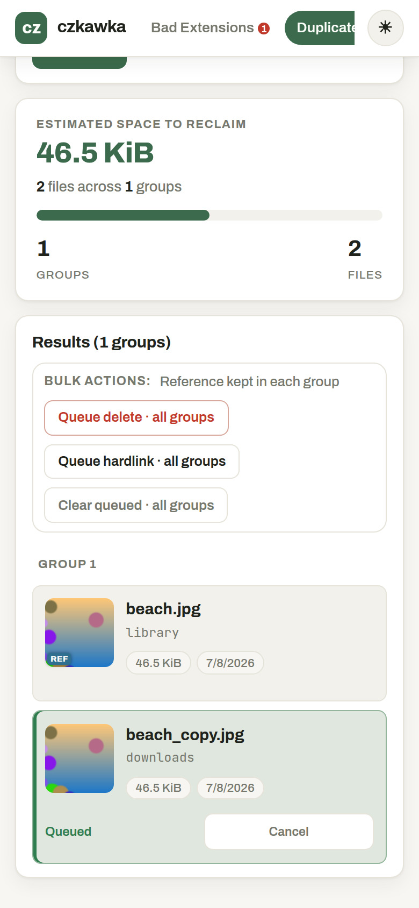

# Czkawka Web GUI

[](https://github.com/thegabriele97/czkawka_webgui/actions/workflows/ci-cd.yml)
[](LICENSE)
[](https://github.com/qarmin/czkawka)

**Find and clean up duplicate files, look-alike photos and videos, and mislabeled files — from any browser, on a
server or NAS you never have to sit in front of.**

A self-hosted web front end for [**czkawka**](https://github.com/qarmin/czkawka), the excellent duplicate/junk-file
finder. czkawka is fantastic, but its GUI wants a desktop session — awkward when your files live on a headless
server, a NAS, or a home lab. This wraps the same engine (`czkawka_core`) in a small web app you can open from your
laptop or your phone: point it at a folder, scan, review matches side by side with live previews, and queue up
deletes/hardlinks to apply in one batch.

Single user, no login, no external job queue — designed to sit behind whatever network boundary you already trust
(LAN, Tailscale, a reverse proxy), not on the open internet.

## Screenshots

<p align="center">
  
</p>

<p align="center"><em>Similar Images — grouped matches, thumbnails, a running "space to reclaim" estimate, and a
live preview panel. A reference folder (here <code>library</code>) is kept untouched; only copies elsewhere are
flagged.</em></p>

<table>
  <tr>
    <td width="50%"></td>
    <td width="50%"></td>
  </tr>
  <tr>
    <td align="center"><em>Exact duplicates, light theme — queued rows highlighted in green.</em></td>
    <td align="center"><em>Bad Extensions — files whose contents don't match their extension, one-click rename.</em></td>
  </tr>
</table>

<h3 align="center">Works on your phone too</h3>

<p align="center">
  
  &nbsp;&nbsp;
  
</p>

<p align="center"><em>The results table collapses into a card list below phone width — same thumbnails, same
delete/hardlink decisions, no sideways scrolling. Dark (Salvage) and light (Daylight) themes included.</em></p>

## What it does

- 🔍 **Four scan types**, same as czkawka_gui: **Duplicates**, **Similar Images**, **Similar Videos**, and
  **Bad Extensions** — with the same advanced options (hash size/algorithm, resize algorithm, crop detection,
  tolerance, ignore-same-size, …), remembered per tool so you don't re-enter them every time.
- 📌 **Reference folders** — mark a folder as an untouchable reference (your curated library, say); matches there are
  only ever *reported*, never deleted or hardlinked. Cleanup happens only in the other folders.
- 🖼️ **Side-by-side previews** with keyboard navigation — arrow-key through results, images and video frames inline,
  full-screen overlay for actual playback. Review large result sets without endless scrolling.
- 🗑️ **Batch delete / hardlink queue** — make your decisions across a whole scan, review the queue, then apply it all
  at once. Nothing touches disk until you hit apply, and one failed file doesn't abort the rest of the batch.
- 📱 **Runs anywhere, syncs everywhere** — start a scan, close the tab, reopen from a different device: progress,
  results and the folder selection all live server-side, so it looks the same from your desk or your couch.
- 🛑 **Stop without losing work** — stopping asks czkawka's engine to wind down *gracefully* rather than killing it,
  so the hash cache it already built is preserved and the next scan is faster, not slower.
- 🎨 **Light & dark themes**, mobile-first responsive layout, no telemetry, no accounts.

## Quick start

Grab it with Docker Compose and you're running in a couple of minutes:

```bash
git clone https://github.com/thegabriele97/czkawka_webgui.git
cd czkawka_webgui
docker compose up --build
```

Then open **http://localhost:5173**.

By default `./data` is mounted into the backend — put (or symlink) whatever you want to scan under there, or edit the
volume in `docker-compose.yml` to point at your real library/downloads folders. Everything scannable and deletable
must live under that mount; the backend refuses to touch anything outside it.

> **First scan:** add a folder in the **Folders** panel, pick a tool tab, hit **Start scan**, and review. Mark a
> folder as a **reference** if it holds originals you never want touched.

## Running prebuilt images (Portainer / plain Compose)

Every push to `main` publishes fresh images to GHCR, so you can skip building from source:

```yaml
services:
  backend:
    image: ghcr.io/thegabriele97/czkawka_webgui-backend:latest
    ports:
      - "8000:8000"
    volumes:
      - /path/to/your/library:/data
      - backend_db:/db
      - bridge_cache:/cache
    restart: unless-stopped

  frontend:
    image: ghcr.io/thegabriele97/czkawka_webgui-frontend:latest
    ports:
      - "5173:5173"
    environment:
      BACKEND_URL: http://backend:8000
    depends_on:
      - backend
    restart: unless-stopped

volumes:
  backend_db:
  bridge_cache:
```

Paste this as a Portainer stack (adjusting the bind mount), or save it as `docker-compose.yml` and run
`docker compose up -d`. Keep the `backend_db` (scan history/settings) and `bridge_cache` (czkawka's hash cache)
volumes around — wiping them means losing scan history and re-hashing everything from scratch.

## Configuration

| Variable              | Default                          | Meaning                                                      |
| ---------------------- | --------------------------------- | -------------------------------------------------------------- |
| `DATA_ROOT`            | `/data`                          | Sandbox root — nothing outside this path is reachable.        |
| `BRIDGE_BIN`           | `/usr/local/bin/czkawka-bridge`  | Path to the bridge binary (set automatically in the Docker image). |
| `DATABASE_PATH`        | `/db/app.db`                     | SQLite database file location.                                |
| `CZKAWKA_CACHE_PATH`   | `/cache`                         | Where czkawka's hash/prehash cache is persisted between scans. |
| `CZKAWKA_CONFIG_PATH`  | `/cache`                         | czkawka's own config directory.                                |

## How it works

Three small pieces, one repo:

```
frontend (React/TS)  ──HTTP──>  backend (FastAPI/Python)  ──subprocess──>  bridge (Rust)  ──>  czkawka_core
```

- **`bridge/`** — a small Rust CLI built directly on top of `czkawka_core` (the actual engine behind czkawka_gui/
  czkawka_cli), streaming scan progress and results as newline-delimited JSON.
- **`backend/`** — a FastAPI app that owns the database (SQLite), spawns bridge subprocesses per scan, tracks
  progress, and exposes a REST API. No Celery/Redis — this is intentionally a small, single-user app.
- **`frontend/`** — a React + TypeScript SPA (Vite), talking only to the backend's REST API.

A full architecture write-up (protocol details, data model, known gotchas, etc.) lives in [`CLAUDE.md`](CLAUDE.md)
for anyone digging into the internals or extending the project.

## Development

Requires Rust (stable), Python 3.12+, and Node 22+.

```bash
# Bridge
cd bridge && cargo build --release && cargo test --release

# Backend (needs the bridge binary built above, and ffmpeg on PATH)
cd backend
pip install -r requirements-dev.txt
TEST_BRIDGE_BIN=../bridge/target/release/czkawka-bridge pytest -q

# Frontend
cd frontend
npm install
npm run build   # type-checks and builds
npm run dev     # dev server
```

CI runs all three test suites on every push/PR to `main`, then builds and publishes Docker images to GHCR on merge.
[Dependabot](.github/dependabot.yml) keeps the bridge's Rust dependencies (including `czkawka_core` itself) up to
date automatically, with the full CI suite running against every bump PR.

Contributions, bug reports and feature ideas are welcome — open an
[issue](https://github.com/thegabriele97/czkawka_webgui/issues) or a PR.

## Credits

Built entirely on top of [czkawka](https://github.com/qarmin/czkawka) by [Rafał Mikrut](https://github.com/qarmin)
and contributors — this project is just a web front end and orchestration layer around `czkawka_core`; all the
actual duplicate/similarity-detection engine is theirs. If this tool is useful to you, go star
[czkawka](https://github.com/qarmin/czkawka) too.

## License

[MIT](LICENSE)
